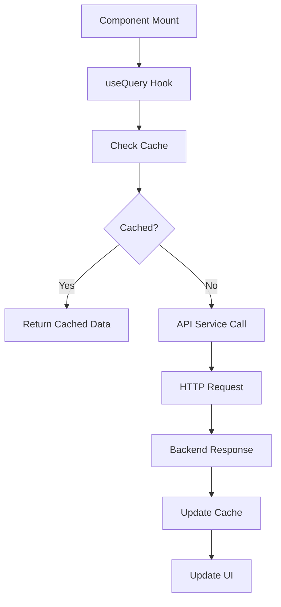

# Application Architecture and Workflow Guide

This guide explains the complete file structure, the purpose of each file/directory, and how components interact to build the CarWash Pro application.

## Table of Contents
- [Project Structure Overview](#project-structure-overview)
- [Core Files Explained](#core-files-explained)
- [Directory Structure and Purpose](#directory-structure-and-purpose)
- [Application Workflow](#application-workflow)
- [File Interaction Patterns](#file-interaction-patterns)
- [Request Flow Example](#request-flow-example)

## Project Structure Overview

```
bling_auto/
├── app/                      # Next.js 15 App Router
├── src/                      # Source code (main application)
│   ├── shared/              # Shared resources across features
│   ├── infrastructure/     # External services and integrations
│   ├── features/           # Feature-specific modules
│   ├── views/             # Page components
│   ├── data/             # Static data and configurations
│   ├── configs/         # App configurations
│   └── lib/            # Third-party integrations
├── public/            # Static assets
├── docs/             # Documentation
└── [config files]   # Project configuration
```

## Core Files Explained

### Root Configuration Files

#### `package.json`
**Purpose**: Defines project dependencies, scripts, and metadata
```json
{
  "name": "carwash-pro",
  "scripts": {
    "dev": "next dev",        // Development server
    "build": "next build",    // Production build
    "start": "next start",    // Production server
    "lint": "next lint",      // Code linting
    "typecheck": "tsc"        // TypeScript checking
  }
}
```
**Why needed**: Central configuration for Node.js project management

#### `tsconfig.json`
**Purpose**: TypeScript compiler configuration
```json
{
  "compilerOptions": {
    "baseUrl": ".",
    "paths": {
      "@/*": ["./src/*"]  // Path aliasing for clean imports
    }
  }
}
```
**Why needed**: Enables TypeScript support and import path aliasing

#### `next.config.js`
**Purpose**: Next.js framework configuration
```js
module.exports = {
  images: { domains: ['example.com'] },
  env: { API_URL: process.env.API_URL }
}
```
**Why needed**: Configures Next.js features and build behavior

#### `tailwind.config.js`
**Purpose**: Tailwind CSS configuration
```js
module.exports = {
  content: ['./src/**/*.{js,ts,jsx,tsx}'],
  theme: { extend: { colors: { brand: '#14b8a6' } } }
}
```
**Why needed**: Customizes design system and styling utilities

#### `.env.local`
**Purpose**: Environment variables (not committed to git)
```bash
NEXT_PUBLIC_API_URL=http://localhost:3001/api
DATABASE_URL=postgresql://...
```
**Why needed**: Stores sensitive configuration and environment-specific settings

### App Router Files (`app/` directory)

#### `app/layout.tsx`
**Purpose**: Root layout wrapper for entire application
```tsx
export default function RootLayout({ children }) {
  return (
    <html lang="en">
      <body>
        <Providers>  {/* Auth, Theme, React Query */}
          <AppLayout>{children}</AppLayout>
        </Providers>
      </body>
    </html>
  )
}
```
**Why needed**: Provides consistent layout and global providers

#### `app/page.tsx`
**Purpose**: Homepage route (/)
```tsx
import LandingPage from '@/views/marketing/LandingPage'
export default function Home() {
  return <LandingPage />
}
```
**Why needed**: Entry point for the application

#### `app/robots.ts`
**Purpose**: SEO robots.txt configuration
```ts
export default function robots() {
  return {
    rules: { userAgent: '*', allow: '/' },
    sitemap: 'https://example.com/sitemap.xml'
  }
}
```
**Why needed**: Controls search engine crawling behavior

#### `app/sitemap.ts`
**Purpose**: Dynamic sitemap generation
```ts
export default function sitemap() {
  return [
    { url: 'https://example.com', lastModified: new Date() },
    { url: 'https://example.com/about', lastModified: new Date() }
  ]
}
```
**Why needed**: Improves SEO by helping search engines discover pages

#### `app/[route]/page.tsx`
**Purpose**: Individual route pages
```tsx
// app/dashboard/page.tsx
import DashboardPage from '@/views/dashboard/DashboardPage'
export default function Dashboard() {
  return <DashboardPage />
}
```
**Why needed**: Defines application routes and URL structure

## Directory Structure and Purpose

### `/src/shared/` - Shared Resources

#### `/src/shared/components/`
**Purpose**: Reusable UI components used across the application

```
components/
├── blocks/           # Large page sections
│   ├── HeroBlock.tsx        # Hero section with CTA
│   ├── FeaturesBlock.tsx    # Feature grid display
│   └── CTABlock.tsx         # Call-to-action section
├── ui/              # Base UI elements
│   ├── Button.tsx          # Button component
│   ├── Card.tsx           # Card container
│   └── Input.tsx         # Form input
└── layouts/         # Layout components
    ├── AppLayout.tsx      # Main app layout
    └── DashboardLayout.tsx # Dashboard-specific layout
```

**Example - Button.tsx**:
```tsx
interface ButtonProps {
  variant?: 'primary' | 'secondary'
  size?: 'sm' | 'md' | 'lg'
  children: React.ReactNode
}

export const Button = ({ variant = 'primary', size = 'md', children, ...props }) => {
  return (
    <button className={cn(baseStyles, variants[variant], sizes[size])} {...props}>
      {children}
    </button>
  )
}
```

#### `/src/shared/utils/`
**Purpose**: Utility functions and helpers

```
utils/
├── utils.ts         # General utilities (cn, formatDate, etc.)
├── validators.ts    # Form validation functions
├── formatters.ts    # Data formatting utilities
└── constants.ts     # Shared constants
```

**Example - utils.ts**:
```tsx
// Class name merger utility
export function cn(...inputs: ClassValue[]) {
  return twMerge(clsx(inputs))
}

// Date formatter
export function formatDate(date: Date): string {
  return new Intl.DateTimeFormat('en-US').format(date)
}
```

#### `/src/shared/types/`
**Purpose**: TypeScript type definitions used across features

```tsx
// types/index.ts
export interface User {
  id: string
  email: string
  role: UserRole
}

export interface Booking {
  id: string
  userId: string
  serviceId: string
  date: Date
  status: BookingStatus
}

export type UserRole = 'Client' | 'Operator' | 'Manager' | 'Owner'
export type BookingStatus = 'pending' | 'confirmed' | 'completed' | 'cancelled'
```

### `/src/infrastructure/` - External Services

#### `/src/infrastructure/auth/`
**Purpose**: Authentication and authorization logic

```
auth/
├── auth.ts          # AuthService class
├── hooks.ts         # useAuth, useUser hooks
└── providers.tsx    # AuthProvider component
```

**Example - auth.ts**:
```tsx
export class AuthService {
  static async login(credentials: LoginCredentials): Promise<User> {
    const response = await apiClient.post('/auth/login', credentials)
    localStorage.setItem('token', response.data.token)
    return response.data.user
  }
  
  static getCurrentUser(): User | null {
    const token = localStorage.getItem('token')
    return token ? decodeToken(token) : null
  }
}
```

#### `/src/infrastructure/api/`
**Purpose**: API client and SDK configuration

```
api/
├── sdk.ts           # Axios client configuration
├── interceptors.ts  # Request/response interceptors
└── endpoints.ts     # API endpoint constants
```

**Example - sdk.ts**:
```tsx
export const apiClient = axios.create({
  baseURL: process.env.NEXT_PUBLIC_API_URL,
  timeout: 10000
})

// Add auth token to requests
apiClient.interceptors.request.use((config) => {
  const token = localStorage.getItem('token')
  if (token) config.headers.Authorization = `Bearer ${token}`
  return config
})
```

#### `/src/infrastructure/providers/`
**Purpose**: Global context providers

```tsx
// providers.tsx
export function Providers({ children }: ProvidersProps) {
  return (
    <ThemeProvider>
      <QueryClientProvider client={queryClient}>
        <AuthProvider>
          {children}
        </AuthProvider>
        <Toaster />
      </QueryClientProvider>
    </ThemeProvider>
  )
}
```

### `/src/features/` - Feature Modules

Each feature is self-contained with its own logic:

```
features/booking/
├── components/      # Feature-specific components
│   ├── BookingForm.tsx
│   └── BookingCard.tsx
├── hooks/          # Feature-specific hooks
│   ├── useBookings.ts
│   └── useCreateBooking.ts
├── services/       # API service layer
│   └── bookingService.ts
├── types/          # Feature types
│   └── index.ts
└── utils/          # Feature utilities
    └── bookingHelpers.ts
```

**Example - Feature Hook**:
```tsx
// features/booking/hooks/useBookings.ts
export const useBookings = () => {
  return useQuery({
    queryKey: ['bookings'],
    queryFn: BookingService.getBookings,
    staleTime: 5 * 60 * 1000
  })
}
```

### `/src/views/` - Page Components

```
views/
├── marketing/       # Public marketing pages
│   ├── LandingPage.tsx
│   └── PricingPage.tsx
├── auth/           # Authentication pages
│   ├── LoginPage.tsx
│   └── RegisterPage.tsx
├── dashboard/      # Dashboard pages
│   └── DashboardPage.tsx
└── apps/           # Application pages
    └── BookingPage.tsx
```

**Example - Page Component**:
```tsx
// views/dashboard/DashboardPage.tsx
const DashboardPage = () => {
  const { user } = useAuth()
  const { data: metrics } = useDashboardMetrics()
  
  return (
    <DashboardLayout>
      <MetricsGrid metrics={metrics} />
      <RecentActivity userId={user.id} />
    </DashboardLayout>
  )
}
```

### `/src/data/` - Static Data

```
data/
├── homePageData.ts  # Landing page content
├── navigation.ts    # Nav menu configuration
└── services.ts      # Service offerings data
```

**Example - homePageData.ts**:
```tsx
export const heroData = {
  title: 'Premium Car Wash',
  subtitle: 'Professional service at your location',
  primaryCTA: {
    text: 'Book Now',
    href: '/booking'
  }
}
```

### `/src/configs/` - Application Configuration

```
configs/
├── themeConfig.ts   # Theme settings
├── siteConfig.ts    # Site metadata
└── featureFlags.ts  # Feature toggles
```

### `/src/lib/` - Third-Party Integrations

```
lib/
├── rbac/           # Role-based access control
├── theme/          # Theme management
└── analytics/      # Analytics integration
```

## Application Workflow

### 1. Initial Page Load Flow

```mermaid
graph TD
    A[Browser Request] --> B[Next.js Server]
    B --> C[app/layout.tsx]
    C --> D[Providers Setup]
    D --> E[Route Handler - app/[route]/page.tsx]
    E --> F[View Component - views/[type]/Page.tsx]
    F --> G[Fetch Data - features/hooks]
    G --> H[API Call - infrastructure/api]
    H --> I[Render UI - shared/components]
    I --> J[Browser Display]
```

### 2. User Authentication Flow

```mermaid
graph TD
    A[User Login] --> B[LoginPage Component]
    B --> C[AuthService.login()]
    C --> D[API Request - /auth/login]
    D --> E[Store Token]
    E --> F[Update AuthContext]
    F --> G[Redirect to Dashboard]
    G --> H[Protected Route Check]
    H --> I[Load User Data]
```

### 3. Data Fetching Flow



## File Interaction Patterns

### Pattern 1: Page Rendering

**Files involved**:
1. `app/dashboard/page.tsx` - Route definition
2. `src/views/dashboard/DashboardPage.tsx` - Page component
3. `src/features/dashboard/hooks/useDashboardData.ts` - Data fetching
4. `src/shared/components/ui/Card.tsx` - UI components
5. `src/infrastructure/api/sdk.ts` - API calls

**Interaction flow**:
```tsx
// 1. Route file imports view
import DashboardPage from '@/views/dashboard/DashboardPage'

// 2. View uses feature hooks
const { data } = useDashboardData()

// 3. Hook calls service
return useQuery({
  queryFn: () => DashboardService.getMetrics()
})

// 4. Service uses SDK
const { data } = await apiClient.get('/dashboard/metrics')

// 5. View renders UI components
return <Card>{data.revenue}</Card>
```

### Pattern 2: Form Submission

**Files involved**:
1. `src/views/apps/BookingPage.tsx` - Form page
2. `src/features/booking/components/BookingForm.tsx` - Form component
3. `src/features/booking/hooks/useCreateBooking.ts` - Mutation hook
4. `src/features/booking/services/bookingService.ts` - API service
5. `src/shared/utils/validators.ts` - Validation

**Interaction flow**:
```tsx
// 1. Page renders form
<BookingForm onSubmit={handleBookingSubmit} />

// 2. Form validates input
const isValid = validateBookingData(formData)

// 3. Form calls mutation
const { mutate } = useCreateBooking()
mutate(formData)

// 4. Mutation calls service
BookingService.createBooking(data)

// 5. Service makes API call
apiClient.post('/bookings', data)
```

### Pattern 3: Protected Routes

**Files involved**:
1. `app/dashboard/layout.tsx` - Layout wrapper
2. `src/infrastructure/auth/providers.tsx` - Auth provider
3. `src/infrastructure/auth/hooks.ts` - Auth hooks
4. `src/lib/rbac/permissions.ts` - Permission check

**Interaction flow**:
```tsx
// 1. Layout checks auth
const { user, isLoading } = useAuth()
if (!user) redirect('/login')

// 2. Check permissions
const canAccess = hasPermission(user.role, 'dashboard.view')

// 3. Render protected content
return <DashboardLayout>{children}</DashboardLayout>
```

## Request Flow Example

### Complete User Journey: Booking a Service

1. **User visits landing page**
   - `app/page.tsx` loads
   - `LandingPage.tsx` renders
   - Static data from `homePageData.ts`
   - UI components from `shared/components/blocks/`

2. **User clicks "Book Now"**
   - Router navigates to `/booking`
   - `app/booking/page.tsx` loads
   - Auth check in layout

3. **User fills booking form**
   - `BookingPage.tsx` renders form
   - `BookingForm.tsx` handles input
   - Validation with `validators.ts`

4. **User submits form**
   - `useCreateBooking` hook triggered
   - `BookingService.createBooking()` called
   - API request via `apiClient`
   - Backend processes request

5. **Success response**
   - Cache updated via React Query
   - Toast notification shown
   - User redirected to confirmation
   - Email sent (backend)

## Component Hierarchy

```
RootLayout (app/layout.tsx)
├── Providers (infrastructure/providers)
│   ├── ThemeProvider
│   ├── QueryClientProvider
│   └── AuthProvider
├── AppLayout (shared/components/layouts)
│   ├── Header
│   ├── Navigation
│   ├── Main Content
│   │   └── Page Component (views/*)
│   │       ├── Feature Hooks (features/*/hooks)
│   │       ├── UI Components (shared/components)
│   │       └── Blocks (shared/components/blocks)
│   └── Footer
└── Toaster (notifications)
```

## State Management Flow

```
Component State (useState)
     ↓
Feature Hooks (React Query)
     ↓
Global Cache (QueryClient)
     ↓
Server State (Backend API)
     
Auth State (AuthContext)
     ↓
Local Storage (Persistence)
```

## Build and Deployment

### Development Build Process
```bash
npm run dev
↓
Next.js Dev Server
↓
TypeScript Compilation
↓
Tailwind CSS JIT
↓
Hot Module Replacement
↓
Browser
```

### Production Build Process
```bash
npm run build
↓
TypeScript Check (tsc)
↓
ESLint Check
↓
Next.js Build
  ├── Static Generation (SSG)
  ├── Server Components
  └── Client Bundles
↓
Optimization
  ├── Code Splitting
  ├── Tree Shaking
  └── Minification
↓
Output to .next/
```

## Key Architectural Decisions

1. **Clean Architecture**: Separation of concerns with clear boundaries
2. **Feature-First Organization**: Features contain their own logic
3. **Shared Components**: Reusable UI elements in shared/
4. **Infrastructure Layer**: External services abstracted
5. **Type Safety**: TypeScript throughout
6. **Server/Client Split**: Next.js App Router for optimal performance
7. **Data Fetching**: React Query for caching and synchronization
8. **Styling**: Tailwind CSS for consistent design system

## Summary

The application follows a modular, scalable architecture where:

1. **App Router** defines routes and layouts
2. **Views** compose pages from blocks and components
3. **Features** encapsulate business logic
4. **Shared** provides reusable resources
5. **Infrastructure** handles external integrations
6. **Data** stores static content

Each layer has clear responsibilities and communicates through well-defined interfaces, making the codebase maintainable, testable, and scalable.